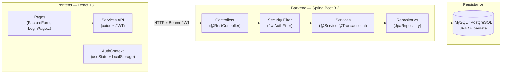
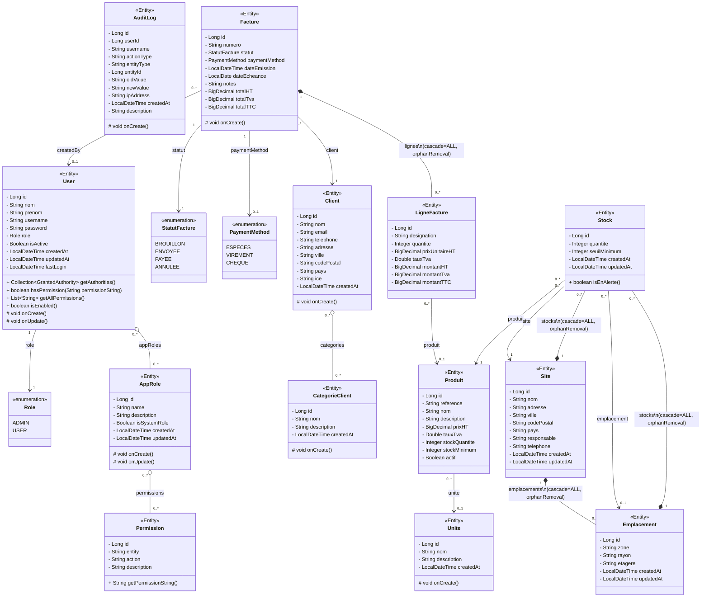
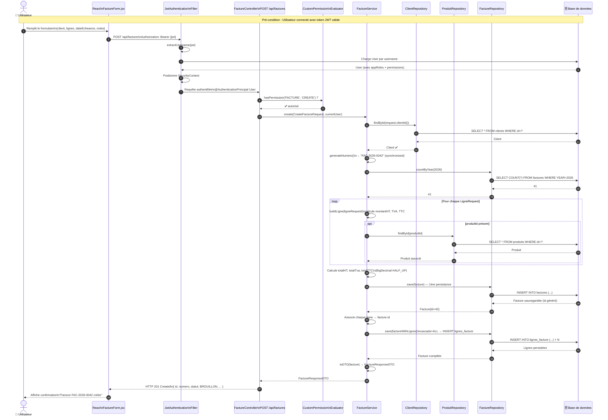
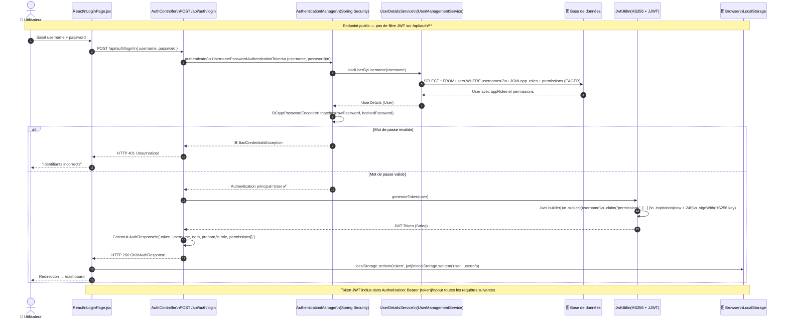

# 🧾 FacturaPro — Système de Gestion de Facturation

> Application web professionnelle de facturation pour PME — Projet de Fin d'Études (PFE)

[](https://spring.io/projects/spring-boot)
[](https://reactjs.org/)
[](https://www.java.com/)
[](https://opensource.org/licenses/MIT)

---

## 📋 Table des matières

- [Fonctionnalités](#-fonctionnalités)
- [Architecture](#-architecture)
- [Diagrammes UML](#-diagrammes-uml)
- [Prérequis](#-prérequis)
- [Installation et Démarrage](#-installation-et-démarrage)
- [Comptes de test](#-comptes-de-test)
- [Configuration IA (Gemini)](#-configuration-ia-gemini)
- [Endpoints API](#-endpoints-api)
- [Structure du projet](#-structure-du-projet)

---

## ✨ Fonctionnalités

### Gestion des factures
- ✅ Création de factures avec lignes de détail (HT, TVA, TTC)
- ✅ Numérotation automatique `FAC-YYYY-XXXX`
- ✅ Gestion du cycle de vie : `BROUILLON → ENVOYÉE → PAYÉE / ANNULÉE`
- ✅ Téléchargement PDF (Thymeleaf + Flying Saucer)
- ✅ Export XML structuré pour l'ERP

### Gestion des clients, produits et stocks
- ✅ CRUD complet clients avec informations fiscales (ICE, catégories)
- ✅ Catalogue de produits/services avec TVA et unités configurables
- ✅ Gestion de stock multi-sites (Site, Emplacement, Stock) avec alertes de seuil minimum

### Intelligence Artificielle (Google Gemini)
- ✅ **ChatBot intégré** — Posez des questions de comptabilité et de facturation
- ✅ **Validation IA** — Détection automatique d'erreurs (TVA, calculs, incohérences)

### Administration & Sécurité
- ✅ Authentification JWT robuste
- ✅ **Gestion des rôles (AppRole)** et permissions granulaires (`FACTURE:CREATE`, `CLIENT:READ`, etc.)
- ✅ Audit complet des actions (`AuditLog`)
- ✅ Tableau de bord avec statistiques financières, évolution du CA et top clients
- ✅ Paramétrage ERP et gestion de la base de données intégrée

---

## 🏗️ Architecture



**Stack technique :**
| Couche | Technologie |
|--------|-------------|
| Backend | Spring Boot 3.2, Spring Security, Spring Data JPA |
| Base de données | H2 (dev) / PostgreSQL (prod) |
| Frontend | React 18, Vite, Recharts, React Router v6 |
| Auth | JWT (jjwt) |
| IA | Google Gemini API (via REST) |
| PDF | Thymeleaf + Flying Saucer (OpenPDF) |

---

## 📐 Diagrammes UML

### 1. Diagramme de Classes (Entités du Domaine et Sécurité)

> [!NOTE]
> Généré à partir de l'analyse des packages `entity`, `model` et `security.entity`. Les relations JPA (@OneToMany, @ManyToOne, @ManyToMany) sont fidèlement représentées avec les multiplicités exactes du code source.



### 2. Diagramme de Cas d'Utilisation

> [!NOTE]
> Acteurs identifiés depuis les annotations `@PreAuthorize`, les rôles `Role.ADMIN`/`Role.USER` et le système de permissions granulaires `ENTITY:ACTION`. Les relations `<<include>>` et `<<extend>>` suivent la notation UML 2.5.



```mermaid
graph TB
    subgraph Acteurs
        ADMIN([👤 Admin\nrole = ADMIN\nSUPER_ADMIN])
        USER([👤 User\nrole = USER])
        SYSTEM([⚙️ Système\nTimer / ERP])
    end

    subgraph UC["🧾 FacturaPro — Cas d'utilisation"]

        subgraph AUTH["🔐 Authentification"]
            UC1(Se connecter\nPOST /api/auth/login)
            UC2(Consulter profil\nGET /api/auth/me)
            UC3(Générer Token JWT\nHS256 + permissions)
        end

        subgraph FACT["🧾 Gestion des Factures\n@PreAuthorize FACTURE:*"]
            UC4(Lister les factures\nFACTURE:READ)
            UC5(Créer une facture\nFACTURE:CREATE)
            UC6(Changer statut facture\nFACTURE:UPDATE)
            UC7(Supprimer une facture\nFACTURE:DELETE)
            UC8(Générer PDF\nFACTURE:READ)
            UC9(Exporter XML / ERP\nFACTURE:READ)
            UC10(Envoyer par Email\nFACTURE:READ)
        end

        subgraph CLIENT["👥 Gestion des Clients\nCLIENT:*"]
            UC11(Lister les clients\nCLIENT:READ)
            UC12(Créer / Modifier client\nCLIENT:CREATE/UPDATE)
            UC13(Supprimer un client\nCLIENT:DELETE)
            UC14(Gérer catégories client)
        end

        subgraph PROD["📦 Gestion des Produits\nPRODUIT:*"]
            UC15(Lister les produits\nPRODUIT:READ)
            UC16(Créer / Modifier produit\nPRODUIT:CREATE/UPDATE)
            UC17(Gérer les unités)
            UC18(Gérer le stock\nSite / Emplacement)
        end

        subgraph ADMIN_UC["⚙️ Administration\nSUPER_ADMIN uniquement"]
            UC19(Gérer les utilisateurs\nCRUD User)
            UC20(Gérer les rôles\nAppRole + Permissions)
            UC21(Tableau de bord Admin\nstatistiques globales)
            UC22(Consulter les audits\nAuditLog)
            UC23(Configurer ERP\nErpConfig + Sync)
            UC24(Configurer base de données\nDatabaseProfile)
            UC25(Chat IA\nOpenAI / Gemini)
        end

    end

    %% === Relations ADMIN ===
    ADMIN --> UC1
    ADMIN --> UC2
    ADMIN --> UC4
    ADMIN --> UC5
    ADMIN --> UC6
    ADMIN --> UC7
    ADMIN --> UC8
    ADMIN --> UC9
    ADMIN --> UC10
    ADMIN --> UC11
    ADMIN --> UC12
    ADMIN --> UC13
    ADMIN --> UC14
    ADMIN --> UC15
    ADMIN --> UC16
    ADMIN --> UC17
    ADMIN --> UC18
    ADMIN --> UC19
    ADMIN --> UC20
    ADMIN --> UC21
    ADMIN --> UC22
    ADMIN --> UC23
    ADMIN --> UC24
    ADMIN --> UC25

    %% === Relations USER (selon permissions) ===
    USER --> UC1
    USER --> UC2
    USER -.->|selon permission| UC4
    USER -.->|selon permission| UC5
    USER -.->|selon permission| UC6
    USER -.->|selon permission| UC8
    USER -.->|selon permission| UC11
    USER -.->|selon permission| UC12
    USER -.->|selon permission| UC15
    USER -.->|selon permission| UC18

    %% === Relations SYSTEM ===
    SYSTEM -.->|scheduled / webhook| UC23

    %% === Include / Extend ===
    UC1 -->|«include»| UC3
    UC5 -->|«include»| UC4
    UC8 -->|«extend»| UC5
    UC9 -->|«extend»| UC5
    UC10 -->|«extend»| UC8
    UC5 -->|«include»| UC11
    UC5 -->|«include»| UC15
```

### 3. Diagrammes de Séquence

#### 3.1 — Création d'une Facture

> [!NOTE]
> Flux complet : frontend React → `FactureController` → `FactureService` → `FactureRepository` → Base de données. Les interactions correspondent exactement au code de `FactureController.create()` et `FactureService.create()`.



#### 3.2 — Authentification JWT (Login)

> [!NOTE]
> Flux d'authentification complet depuis le formulaire React jusqu'à la génération du token JWT signé HS256. Correspond exactement à `AuthController.login()` et `JwtUtil.generateToken()`.



#### 3.3 — Génération PDF d'une Facture

> [!NOTE]
> Flux de génération PDF : `FactureController.generatePdf()` → `PdfService` → moteur Thymeleaf (HTML) → Flying Saucer (XHTML → PDF). Le fichier PDF est retourné en `application/pdf` avec Content-Disposition pour le téléchargement.

```mermaid
sequenceDiagram
    autonumber
    actor Utilisateur as 👤 Utilisateur
    participant React as React\nFactureDetail.jsx
    participant Filter as JwtAuthentication\nFilter
    participant Ctrl as FactureController\nGET /api/factures/{id}/pdf
    participant Auth as CustomPermission\nEvaluator
    participant FactureSvc as FactureService
    participant PdfSvc as PdfService
    participant Thymeleaf as TemplateEngine\n(Thymeleaf)
    participant Renderer as ITextRenderer\n(Flying Saucer)
    participant DB as 🗄️ Base de données

    Utilisateur->>React: Clique "Télécharger PDF"
    React->>Filter: GET /api/factures/42/pdf\nAuthorization: Bearer {jwt}

    Filter->>Filter: Valide JWT → extrait username
    Filter->>DB: Charge User + permissions
    DB-->>Filter: User authentifié
    Filter->>Ctrl: Requête transmise

    Ctrl->>Auth: hasPermission('FACTURE', 'READ') ?
    Auth-->>Ctrl: ✅ Autorisé

    Ctrl->>FactureSvc: findById(42)
    FactureSvc->>DB: SELECT facture + client + lignes\nWHERE id=42
    DB-->>FactureSvc: Entité Facture complète
    FactureSvc->>FactureSvc: toDTO(facture)\n→ FactureResponseDTO
    FactureSvc-->>Ctrl: FactureResponseDTO{id=42, ...}

    Ctrl->>PdfSvc: generateFacturePdf(factureDTO)

    PdfSvc->>PdfSvc: Prépare Context Thymeleaf\n{ facture, dateEmissionFormatee }

    PdfSvc->>Thymeleaf: process("facture-template", context)
    Thymeleaf->>Thymeleaf: Résout le template HTML\n(resources/templates/facture-template.html)
    Thymeleaf-->>PdfSvc: HTML/XHTML string généré

    PdfSvc->>Renderer: setDocumentFromString(htmlContent)
    Renderer->>Renderer: Parse XHTML + CSS inline
    Renderer->>Renderer: layout() — calcul mise en page
    Renderer->>Renderer: createPDF(outputStream)
    Renderer-->>PdfSvc: ByteArrayOutputStream rempli

    PdfSvc-->>Ctrl: byte[] (contenu PDF)

    Ctrl->>Ctrl: Construit ResponseEntity\nContent-Type: application/pdf\nContent-Disposition: attachment;\n  filename="Facture_FAC-2026-0042.pdf"

    Ctrl-->>React: HTTP 200 OK\n[binary PDF data]
    React->>React: Crée Blob URL\n→ déclenche téléchargement navigateur
    React-->>Utilisateur: 📄 Téléchargement PDF lancé

    alt Erreur de rendu PDF
        Renderer-->>PdfSvc: Exception
        PdfSvc-->>Ctrl: Exception propagée
        Ctrl-->>React: HTTP 500 Internal Server Error
        React-->>Utilisateur: "Erreur lors de la génération du PDF"
    end
```

---

## 📦 Prérequis

- Java 17+
- Maven 3.8+
- Node.js 18+ et npm

---

## 🚀 Installation et Démarrage

### 1. Cloner le projet

```bash
git clone <url-du-repo>
cd facturation-app
```

### 2. Démarrer le Backend

```bash
cd backend
mvn spring-boot:run
```

> Le serveur démarre sur `http://localhost:8080`
> La console H2 est disponible sur `http://localhost:8080/h2-console`

### 3. Démarrer le Frontend

```bash
cd frontend
npm install
npm run dev
```

> L'application est disponible sur `http://localhost:5173`

---

## 👤 Comptes de test

Les comptes suivants sont créés automatiquement au premier démarrage :

| Rôle | Username / Identifiant | Mot de passe |
|------|-------|--------------|
| **ADMIN** | `admin` | `admin123` |
| **USER** | `user` | `user123` |

---

## 🤖 Configuration IA (Gemini)

Pour activer l'assistant IA et la validation de factures, une clé API Google Gemini est nécessaire :

1. Créer une clé gratuite sur [Google AI Studio](https://aistudio.google.com/app/apikey)
2. Modifier `backend/src/main/resources/application.properties` :

```properties
gemini.api.key=VOTRE_CLE_API_ICI
```

---

## 📡 Endpoints API

La documentation Swagger interactive est disponible sur : `http://localhost:8080/swagger-ui.html`

| Méthode | Endpoint | Description |
|---------|----------|-------------|
| POST | `/api/auth/login` | Connexion (retourne JWT) |
| GET | `/api/factures` | Liste des factures |
| POST | `/api/factures` | Créer une facture |
| PATCH | `/api/factures/{id}/statut` | Changer le statut |
| GET | `/api/factures/{id}/pdf` | Télécharger le PDF |
| GET | `/api/factures/{id}/export-xml` | Exporter en XML |
| POST | `/api/ai/chat` | Poser une question à l'IA |
| GET | `/api/dashboard/stats` | Statistiques Dashboard |

---

## 📂 Structure du projet

```
facturation-app/
├── backend/          # Spring Boot 3.2 (Java 17)
│   ├── src/main/java/com/pfe/facturation/
│   │   ├── controller/   # REST Controllers
│   │   ├── service/      # Logique métier
│   │   ├── repository/   # Spring Data JPA
│   │   ├── entity/       # Entités JPA Métier
│   │   ├── model/        # Entités Administration & Rôles
│   │   └── security/     # JWT, Configuration Sécurité
│   └── src/main/resources/
│       └── templates/    # Templates Thymeleaf (PDF)
│
└── frontend/         # React 18 + Vite
    └── src/
        ├── components/   # Composants réutilisables
        ├── context/      # Contextes React (AuthContext)
        ├── pages/        # Vues principales (Dashboard, Factures...)
        └── services/     # Appels API (Axios)
```
