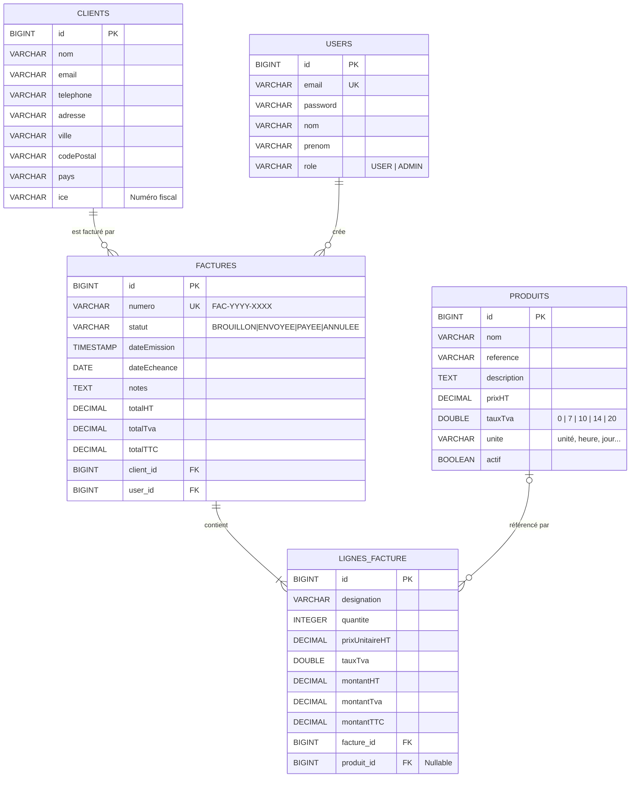

# 🧾 FacturaPro — Système de Gestion de Facturation

> Application web professionnelle de facturation pour PME — Projet de Fin d'Études (PFE)

[](https://spring.io/projects/spring-boot)
[](https://reactjs.org/)
[](https://www.java.com/)
[](https://opensource.org/licenses/MIT)

---

## 📋 Table des matières

- [Fonctionnalités](#-fonctionnalités)
- [Architecture](#-architecture)
- [Prérequis](#-prérequis)
- [Installation et Démarrage](#-installation-et-démarrage)
- [Comptes de test](#-comptes-de-test)
- [Configuration IA (Gemini)](#-configuration-ia-gemini)
- [Endpoints API](#-endpoints-api)
- [Tests](#-tests)
- [Structure du projet](#-structure-du-projet)

---

## ✨ Fonctionnalités

### Gestion des factures
- ✅ Création de factures avec lignes de détail (HT, TVA, TTC)
- ✅ Numérotation automatique `FAC-YYYY-XXXX`
- ✅ Gestion du cycle de vie : `BROUILLON → ENVOYÉE → PAYÉE / ANNULÉE`
- ✅ Téléchargement PDF (Thymeleaf + Flying Saucer)
- ✅ Export XML structuré

### Gestion des clients et produits
- ✅ CRUD complet clients avec informations fiscales (ICE)
- ✅ Catalogue de produits/services avec TVA configurables

### Intelligence Artificielle (Google Gemini)
- ✅ **ChatBot intégré** — Posez des questions de comptabilité et de facturation
- ✅ **Validation IA** — Détection automatique d'erreurs (TVA, calculs, incohérences)

### Tableau de bord (ADMIN)
- ✅ Statistiques en temps réel : Clients, Produits, Factures, CA encaissé
- ✅ Graphique d'évolution du CA mensuel (Recharts)
- ✅ Classement Top 5 Clients par chiffre d'affaires

### Sécurité
- ✅ Authentification JWT (Stateless)
- ✅ Gestion des rôles `ADMIN` / `USER`
- ✅ Statistiques financières réservées aux ADMIN

---

## 🏗️ Architecture

```
facturation-app/
├── backend/          # Spring Boot 3 (Java 17)
│   ├── src/main/java/com/pfe/facturation/
│   │   ├── controller/   # REST Controllers
│   │   ├── service/      # Logique métier
│   │   ├── repository/   # Spring Data JPA
│   │   ├── entity/       # Entités JPA
│   │   ├── dto/          # DTOs (Records Java)
│   │   └── security/     # JWT, Spring Security
│   └── src/main/resources/
│       └── templates/    # Template PDF (Thymeleaf)
│
└── frontend/         # React 18 + Vite
    └── src/
        ├── pages/    # Dashboard, Factures, Clients, Produits
        ├── services/ # Axios API Services
        └── components/ # Layout, ChatAssistant, PrivateRoute
```

**Stack technique :**
| Couche | Technologie |
|--------|-------------|
| Backend | Spring Boot 3.5, Spring Security 6, Spring Data JPA |
| Base de données | H2 (dev) / PostgreSQL (prod) |
| Frontend | React 18, Vite, Recharts, React Hot Toast |
| Auth | JWT (jjwt) |
| IA | Google Gemini API (via REST) |
| PDF | Thymeleaf + Flying Saucer (OpenPDF) |
| Tests | JUnit 5, Mockito |

---

## 📦 Prérequis

- Java 17+
- Maven 3.8+
- Node.js 18+ et npm

---

## 🚀 Installation et Démarrage

### 1. Cloner le projet

```bash
git clone <url-du-repo>
cd facturation-app
```

### 2. Démarrer le Backend

```bash
cd backend
mvn spring-boot:run
```

> Le serveur démarre sur `http://localhost:8080`
> La console H2 est disponible sur `http://localhost:8080/h2-console`

### 3. Démarrer le Frontend

```bash
cd frontend
npm install
npm run dev
```

> L'application est disponible sur `http://localhost:5173`

---

## 👤 Comptes de test

Les comptes suivants sont créés automatiquement au premier démarrage :

| Rôle | Email | Mot de passe |
|------|-------|--------------|
| **ADMIN** | `admin@test.com` | `admin123` |
| **USER** | `user@test.com` | `user123` |

---

## 🤖 Configuration IA (Gemini)

Pour activer l'assistant IA et la validation de factures, une clé API Google Gemini est nécessaire :

1. Créer une clé gratuite sur [Google AI Studio](https://aistudio.google.com/app/apikey)
2. Modifier `backend/src/main/resources/application.properties` :

```properties
gemini.api.key=VOTRE_CLE_API_ICI
```

---

## 📡 Endpoints API

La documentation Swagger interactive est disponible sur : `http://localhost:8080/swagger-ui.html`

| Méthode | Endpoint | Description |
|---------|----------|-------------|
| POST | `/api/auth/login` | Connexion (retourne JWT) |
| POST | `/api/auth/register` | Inscription |
| GET | `/api/factures` | Liste des factures |
| POST | `/api/factures` | Créer une facture |
| PATCH | `/api/factures/{id}/statut` | Changer le statut |
| GET | `/api/factures/{id}/export-pdf` | Télécharger le PDF |
| GET | `/api/factures/{id}/export-xml` | Exporter en XML |
| POST | `/api/ai/chat` | Poser une question à l'IA |
| POST | `/api/ai/valider-facture` | Valider une facture par IA |
| GET | `/api/dashboard/stats` | Statistiques Dashboard |

---

## 🧪 Tests

Lancer les tests unitaires :

```bash
cd backend
mvn test
```

Les tests couvrent :
- **Transitions de statut** : BROUILLON → ENVOYÉE, états terminaux (PAYÉE, ANNULÉE)
- **Calculs BigDecimal** : HT × Quantité, TVA, TTC sur plusieurs lignes
- **Suppression protégée** : Impossible de supprimer une facture PAYÉE
- **Gestion des erreurs** : Client introuvable, facture introuvable

---

## 📂 Structure du projet

```
backend/src/main/java/com/pfe/facturation/
├── controller/
│   ├── FactureController.java    # CRUD Factures + PDF/XML
│   ├── ClientController.java
│   ├── ProduitController.java
│   ├── DashboardController.java
│   └── AiController.java         # Chat IA + Validation
├── service/
│   ├── FactureService.java       # Logique métier principale
│   ├── PdfService.java           # Génération PDF
│   ├── XmlExportService.java     # Export XML
│   ├── AiChatService.java        # Intégration Gemini API
│   └── FactureValidationService.java
├── entity/
│   ├── Facture.java
│   ├── LigneFacture.java
│   ├── Client.java
│   └── Produit.java
└── security/
    ├── config/SecurityConfig.java
    ├── jwt/JwtUtil.java
    └── entity/User.java
```

---

## 🗄️ Schéma Entité-Relation (ER)



