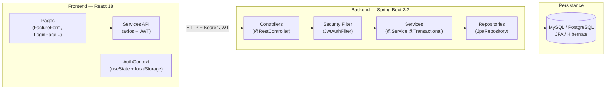
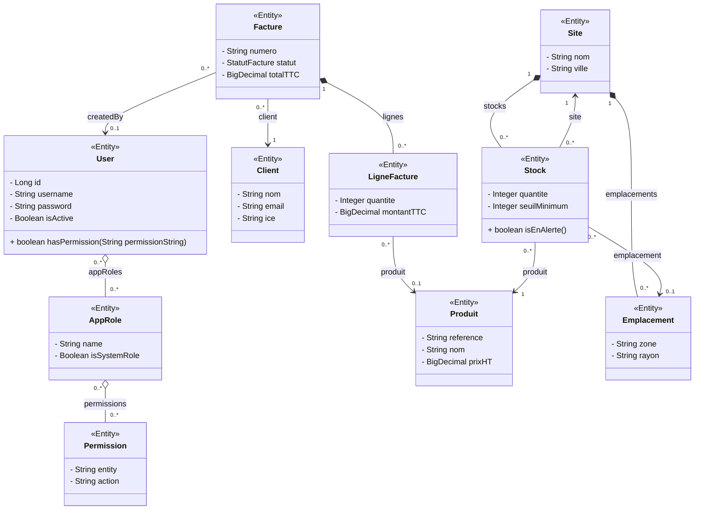
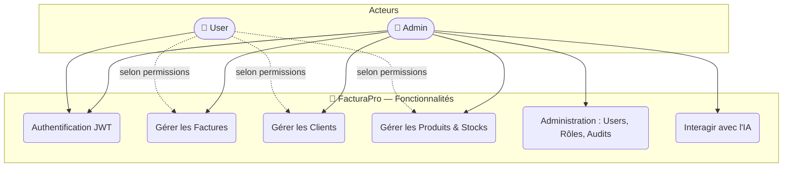
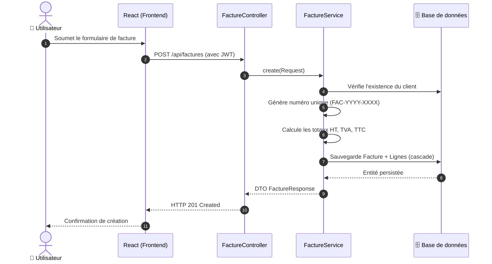

# 🧾 FacturaPro — Système de Gestion de Facturation

> Application web professionnelle de facturation pour PME — Projet de Fin d'Études (PFE)

[](https://spring.io/projects/spring-boot)
[](https://reactjs.org/)
[](https://www.java.com/)
[](https://opensource.org/licenses/MIT)

---

## 📋 Table des matières

- [Fonctionnalités](#-fonctionnalités)
- [Architecture](#-architecture)
- [Diagrammes UML](#-diagrammes-uml)
- [Prérequis](#-prérequis)
- [Installation et Démarrage](#-installation-et-démarrage)
- [Comptes de test](#-comptes-de-test)
- [Configuration IA (Gemini)](#-configuration-ia-gemini)
- [Endpoints API](#-endpoints-api)
- [Structure du projet](#-structure-du-projet)

---

## ✨ Fonctionnalités

### Gestion des factures
- ✅ Création de factures avec lignes de détail (HT, TVA, TTC)
- ✅ Numérotation automatique `FAC-YYYY-XXXX`
- ✅ Gestion du cycle de vie : `BROUILLON → ENVOYÉE → PAYÉE / ANNULÉE`
- ✅ Téléchargement PDF (Thymeleaf + Flying Saucer)
- ✅ Export XML structuré pour l'ERP

### Gestion des clients, produits et stocks
- ✅ CRUD complet clients avec informations fiscales (ICE, catégories)
- ✅ Catalogue de produits/services avec TVA et unités configurables
- ✅ Gestion de stock multi-sites (Site, Emplacement, Stock) avec alertes de seuil minimum

### Intelligence Artificielle (Google Gemini)
- ✅ **ChatBot intégré** — Posez des questions de comptabilité et de facturation
- ✅ **Validation IA** — Détection automatique d'erreurs (TVA, calculs, incohérences)

### Administration & Sécurité
- ✅ Authentification JWT robuste
- ✅ **Gestion des rôles (AppRole)** et permissions granulaires (`FACTURE:CREATE`, `CLIENT:READ`, etc.)
- ✅ Audit complet des actions (`AuditLog`)
- ✅ Tableau de bord avec statistiques financières, évolution du CA et top clients
- ✅ Paramétrage ERP et gestion de la base de données intégrée

---

## 🏗️ Architecture



**Stack technique :**
| Couche | Technologie |
|--------|-------------|
| Backend | Spring Boot 3.2, Spring Security, Spring Data JPA |
| Base de données | H2 (dev) / PostgreSQL (prod) |
| Frontend | React 18, Vite, Recharts, React Router v6 |
| Auth | JWT (jjwt) |
| IA | Google Gemini API (via REST) |
| PDF | Thymeleaf + Flying Saucer (OpenPDF) |

---

## 📐 Diagrammes UML

### 1. Diagramme de Classes (Entités du Domaine)



### 2. Diagramme de Cas d'Utilisation



### 3. Diagramme de Séquence : Création d'une Facture



---

## 📦 Prérequis

- Java 17+
- Maven 3.8+
- Node.js 18+ et npm

---

## 🚀 Installation et Démarrage

### 1. Cloner le projet

```bash
git clone <url-du-repo>
cd facturation-app
```

### 2. Démarrer le Backend

```bash
cd backend
mvn spring-boot:run
```

> Le serveur démarre sur `http://localhost:8080`
> La console H2 est disponible sur `http://localhost:8080/h2-console`

### 3. Démarrer le Frontend

```bash
cd frontend
npm install
npm run dev
```

> L'application est disponible sur `http://localhost:5173`

---

## 👤 Comptes de test

Les comptes suivants sont créés automatiquement au premier démarrage :

| Rôle | Username / Identifiant | Mot de passe |
|------|-------|--------------|
| **ADMIN** | `admin` | `admin123` |
| **USER** | `user` | `user123` |

---

## 🤖 Configuration IA (Gemini)

Pour activer l'assistant IA et la validation de factures, une clé API Google Gemini est nécessaire :

1. Créer une clé gratuite sur [Google AI Studio](https://aistudio.google.com/app/apikey)
2. Modifier `backend/src/main/resources/application.properties` :

```properties
gemini.api.key=VOTRE_CLE_API_ICI
```

---

## 📡 Endpoints API

La documentation Swagger interactive est disponible sur : `http://localhost:8080/swagger-ui.html`

| Méthode | Endpoint | Description |
|---------|----------|-------------|
| POST | `/api/auth/login` | Connexion (retourne JWT) |
| GET | `/api/factures` | Liste des factures |
| POST | `/api/factures` | Créer une facture |
| PATCH | `/api/factures/{id}/statut` | Changer le statut |
| GET | `/api/factures/{id}/pdf` | Télécharger le PDF |
| GET | `/api/factures/{id}/export-xml` | Exporter en XML |
| POST | `/api/ai/chat` | Poser une question à l'IA |
| GET | `/api/dashboard/stats` | Statistiques Dashboard |

---

## 📂 Structure du projet

```
facturation-app/
├── backend/          # Spring Boot 3.2 (Java 17)
│   ├── src/main/java/com/pfe/facturation/
│   │   ├── controller/   # REST Controllers
│   │   ├── service/      # Logique métier
│   │   ├── repository/   # Spring Data JPA
│   │   ├── entity/       # Entités JPA Métier
│   │   ├── model/        # Entités Administration & Rôles
│   │   └── security/     # JWT, Configuration Sécurité
│   └── src/main/resources/
│       └── templates/    # Templates Thymeleaf (PDF)
│
└── frontend/         # React 18 + Vite
    └── src/
        ├── components/   # Composants réutilisables
        ├── context/      # Contextes React (AuthContext)
        ├── pages/        # Vues principales (Dashboard, Factures...)
        └── services/     # Appels API (Axios)
```
